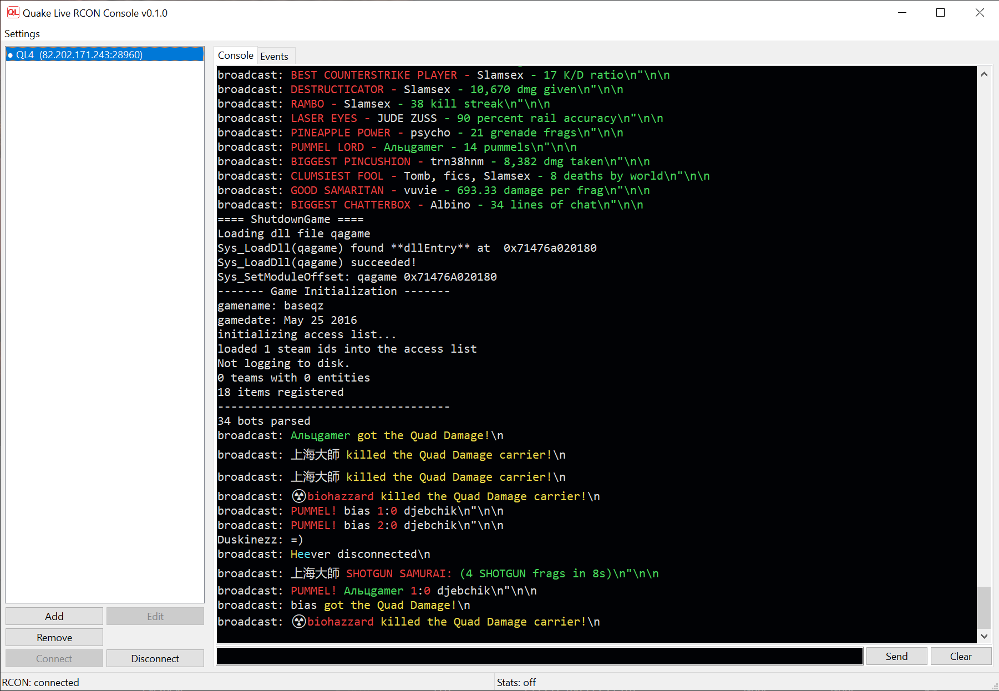

# -console

***English** · [Русский](README.md)*

An admin tool for **Quake Live** servers: connect over RCON, send commands, view
server replies and the live event stream (kills, chat, connections). Supports
multiple servers with quick switching between them.

GUI built with **wxPython**, talking to the server over **ZeroMQ** (`pyzmq`).



## Requirements

- Python **3.14** (3.12+ supported)
- [uv](https://docs.astral.sh/uv/) for package management

## Running

```bash
uv sync          # create the environment and install dependencies
uv run main.py   # launch the app
# or
uv run ql-console
```

## Server setup

In the app: **Add** → enter a name, host/IP, RCON port and password; optionally
enable the event subscription (stats port and password).

The Quake Live server must have these cvars set:

```
+set zmq_rcon_enable 1
+set zmq_rcon_password "<password>"
+set zmq_rcon_port <port>
+set zmq_stats_enable 1          # for the events panel
+set zmq_stats_password "<password>"
+set zmq_stats_port <port>
```

## Where settings are stored

The server list is kept in a plain JSON file (passwords are stored in clear text,
so keep the file private):

- default: `%APPDATA%\ql_console\servers.json`
- override with the `QL_CONSOLE_CONFIG` environment variable

## Protocol (implementation notes)

- **RCON** — a `DEALER` socket, PLAIN auth (`username=rcon`, `zap_domain=rcon`),
  a random `IDENTITY`; after the connection is established a `register` frame is
  sent, then commands; replies arrive as text.
- **Stats** — a `SUB` socket subscribed to everything, PLAIN auth
  (`username=stats`, `zap_domain=stats`); events arrive as JSON. No registration
  required.

All network I/O runs on background threads; results are delivered to the GUI via
`wx.CallAfter`.

## Building an .exe

```bash
uv sync                              # installs dev dependencies (PyInstaller)
uv run python tools/build_exe.py
```

The result is a `dist/ql-console/` folder containing `ql-console.exe` (one-dir
mode, no console window, with an icon). Distribute the whole folder. The script
bundles the icons folder and the generated cvar catalog (`_generated.py`) if
present. Just re-run it after changing code or assets.
